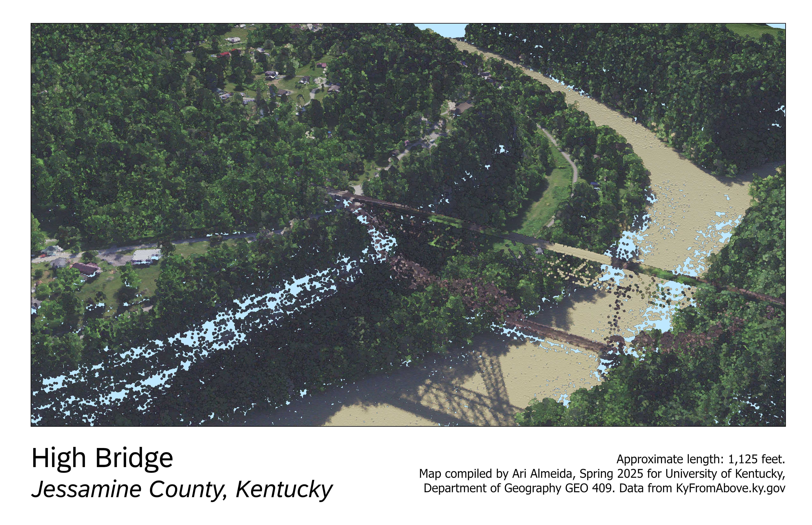
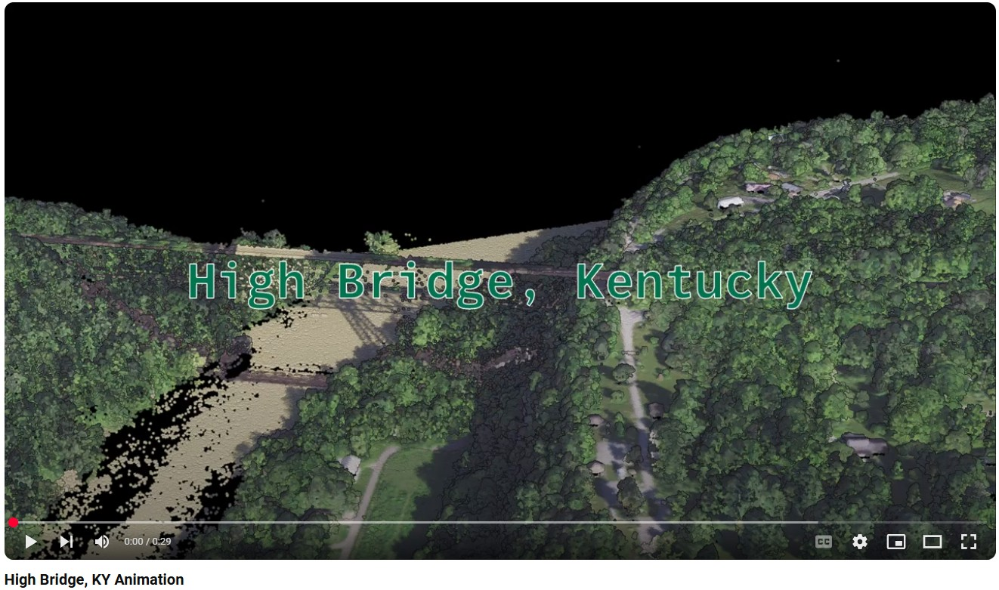

# High Bridge

The High Bridge is a historic railroad bridge located near Wilmore in Jessamine County, Kentucky, notable for being one of the highest railroad bridges in the United States when completed in 1877. Spanning the limestone gorge of the Kentucky River, High Bridge was an engineering marvel of its era, originally designed by famed bridge engineer John A. Roebling. Today, it stands approximately 275 feet above the river, serving as an iconic landmark that combines historical significance with spectacular views, symbolizing Kentucky’s industrial heritage.

  
Point cloud of High Bridge

  
_[Link to animation](https://youtu.be/BESX5C1KcAE)_